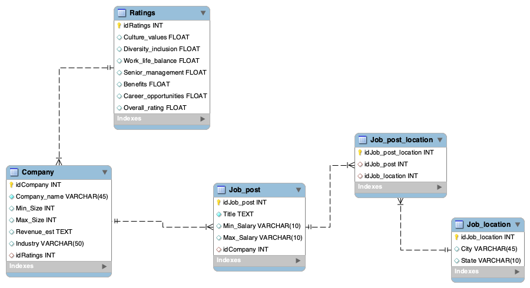

# Data Mining : Glassdoor job search platform
Git project repository:
https://github.com/charlieabtbl/datamining_itc_amit_charlotte.git

## Website : www.glassdoor.com. 
Founded in 2007 in California, Glassdoor is a website where current and former employees anonymously review companies. 
Glassdoor also allows users to anonymously submit and view salaries as well as search and apply for jobs on its platform.

## Objective
The objective of the project is to build a database describing the current job offers from different companies, according to selected filters (location and type of position) according to the user search.
This type of database could be very useful in a job search. 

## Method
(1) scraping Glassdoor job offers based on user's parameters
(2) inserting scraped data into a database
(3) enriching the data with stock information on selected companies

## Structure of the project
(1) GlassdoorScraper.py:  
      - importing all the necessary modules :  
      - defining the command line argument to enter search parameters. 
      - defining two classes
      
        the Scrapper Manager :  download the page contents, get the elements, and save them in a pandas dataframe
        the Job class : extract the features and the urls of each job position. 
        
  
(2) glassdoor_robots.txt
    This file is the robots.txt file from Glassdoor that informs others on what they are allowed to scrap or not on the website. 

(3) requirements.txt
This file informs on all the installations required to allow the code to run.

(4) config.json
Holds constants regarding :
- the Scraper : do not forget to change chromedriver extension and result path
- the Database : do not forget to change host, user and password
- the API 

(5) Stock_API.py 
This file holds the function that extracts the data from the Stock API. You do not need a publisher id for this API.

(6) Database.py
This file contains the code to connect, design and insert scraped and API values to the database.

## Run the script

(0) Make sure you have installed mysql.connector and that you have your username and password for identification. Change the constants in the config gile.

(1) Clone the git repository on your local system.

(2) Download Chrome driver : https://chromedriver.storage.googleapis.com/index.html?path=87.0.4280.20/
and make sure to place it within the same directory of the script file.

(3) Modify the parameters inside the config.json file in accordance to your setup

(4) Open GlassdoorScraper.py and run with -h parameter to get help

(5) Run the script Glassdoor Scraper and personalize your search

WARNING : DO NOT USE SINGLE QUOTES WHEN ENTERING ARGUMENTS.
ONLY USE DOUBLE QUOTES

(6) OUTPUT : a csv file should be saved as res_path as the output and you can access the database model under the name you chose or GlassdoorDB (default name) in Workbench or by connecting to mySql in the terminal.

## The database GlassdoorDB

We created 5 tables in total (including one connection table): 

- Company : this table contains the information related to the company that posted a job offer : idCompany (Primary key), Company_name, Min_size (minimum number of employees of the company), Max_size (maximum number of employees of the company), Revenue_est, Industry, idRatings (Foreign key that connects the table to the Ratings table  : 1 to many - 1 company can have 1 rating max while 1 rating can correspond to multiple companies)

- Job_post : this table contains the information related to the job position offer posted by each company : idJob_post (Primary key), Title (job position), Min_salary (minimum salary), Max_salary (maximum salary), idCompany (Foreign key that connects the table to the Company table : 1 to many - 1 company can have multiple job posts, while 1 job_post can only have 1 company)

- Ratings : this table contains the information related to the different variables of ratings for a company : idRatings (Primary key), Culture_values, Diversity_inclusion, Work_life_balance, Senior_management, Benefits, Career_opportunities, Overall_ratings

- Job_location : this table contains the information related to the location corresponding to the job offer :idJob_location (Primary key), City, State. This table has a many to many relationship with the Job_post table. Therefore we created a Job_post_location table as a connection table. 

